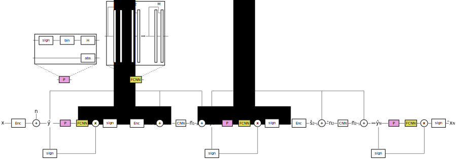

# Step-by-step to update from Iterative-BP-CNN to our custom BP

## For training

- Convert our Neural BP to TF1
- Incorporate into the network code the `P` block from the network modeling image
- Incorporate into the network code the multiplication by $ŷ_x$ and the `sign` computation post-FCNN from the network modeling image

## For simulation

- Simply replace `bp_decoder.decode` call to call our neural BP model, insteadd of calling the general use case BP
- Update `denoising_and_calc_LLR_awgn` and `denoising_and_calc_LLR_epdf` to take into consideration the proposed architecture

---

## Doubts

- Should we convert this code to TF2 to make it easier to convert from PyTorch?
-
